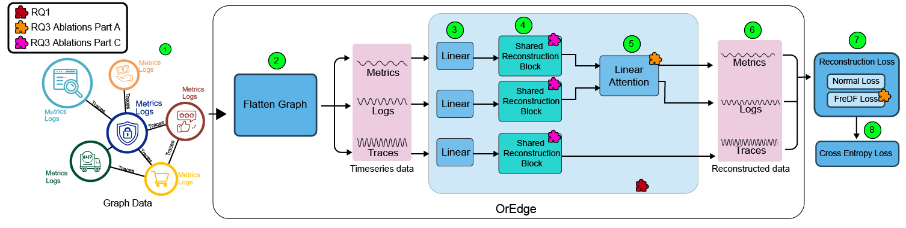
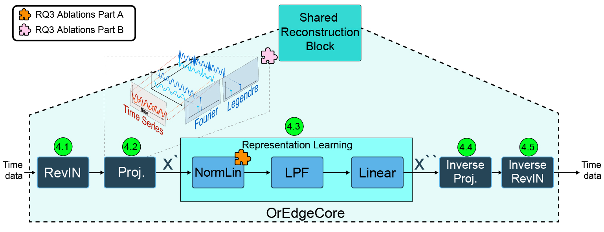

# OrEdge: Efficient Multi-Modal Anomaly Detection in Distributed Software Systems via Orthogonal-Domain Learning

Official PyTorch implementation of **OrEdge**.

OrEdge is a lightweight multi-modal anomaly detection framework for distributed software systems that jointly models **metrics**, **logs**, and **traces** using orthogonal-domain temporal representations. Compared with graph- and Transformer-based approaches, OrEdge significantly reduces computational complexity while maintaining competitive detection performance, making it suitable for deployment on resource-constrained edge devices.

This implementation builds upon the excellent open-source implementations of **Eadro** and **Twin Graph-based Anomaly Detection via Attentive Multi-Modal Learning for Microservice Systems**.

---

# Overview

<p align="center">

</p>

<p align="center">

</p>

---

# Repository Structure

```text
.
├── data/                  # Datasets
├── dgl/                   # DGL utilities
├── result/                # Training checkpoints
├── result_journal/        # Experiment results
├── scripts/               # Figure and table generation
├── src/                   # Model implementation
├── util/                  # Data preprocessing and utilities
├── main.py
├── requirements.txt
├── run_RQ1_main.sh
├── run_RQ3_ablations.sh
├── run_RQ4_sensitivity.sh
├── run_RQ5_case_study.sh
└── copy.sh                # To copy the weights from the server to the Raspberry Pi devices
```

---

# Environment

Experiments were conducted using

- Ubuntu 18.04
- Python 3.8
- PyTorch 1.12.0
- PyTorch Geometric 2.2.0

Install all dependencies using

```bash
pip install -r requirements.txt
```

---

# Datasets

## MSDS

The **MSDS** dataset is available from Zenodo:

https://zenodo.org/record/3549604

After downloading, place the dataset under

```text
data/
└── MSDS/
    └── concurrent_data/
```

---

## SockShop (SN) and TrainTicket (TT)

The **SN** and **TT** datasets can be downloaded from the Eadro repository:

https://doi.org/10.5281/zenodo.7615393

---

# Dataset Preprocessing

## MSDS

```bash
python util/pre_MSDS.py
```

## SN and TT

We follow the preprocessing procedure provided by Eadro.

```bash
cd data/Eadro_for_SN_TT/codes

python main.py --data <dataset_name>
```

---

# Reproducing the Paper

The experiments reported in the paper can be reproduced using the following scripts.

| Research Question | Script |
|-------------------|--------|
| RQ1: Main comparison | `./run_RQ1_main.sh` |
| RQ3: Ablation study | `./run_RQ3_ablations.sh` |
| RQ4: Sensitivity analysis | `./run_RQ4_sensitivity.sh` |
| RQ5: Qualitative case study | `./run_RQ5_case_study.sh` |

---

# Edge Deployment

The Raspberry Pi experiments were conducted using dedicated branches.

| Device | Branch |
|---------|--------|
| Raspberry Pi 5 | `(from-rasperipi-larger)` |
| Raspberry Pi 3 | `(from-rasperipi-smaller)` |

These branches contain the deployment-specific inference code used to generate the efficiency results reported in the paper.

To reproduce the edge-device evaluation, use

```bash
./run_RQ2_main_inference.sh
```

inside the corresponding Raspberry Pi branch.

---

# Generating Paper Figures and Tables

After training, the following scripts generate the figures and tables used in the paper.

```text
scripts/RQ1_accuracy.py
scripts/RQ2_efficiency.py
scripts/RQ3_ablations.py
scripts/RQ4_sensitivity.py
scripts/RQ4_sensitivity_linear_attn.py
scripts/RQ5_case_study.py
```

---

# Acknowledgements

This repository builds upon the open-source implementations of

- Eadro
- Twin Graph-based Anomaly Detection via Attentive Multi-Modal Learning for Microservice Systems

We sincerely thank the original authors for making their implementations publicly available.

---

# Contact

If you have any questions, bug reports, or suggestions, please open a GitHub Issue.